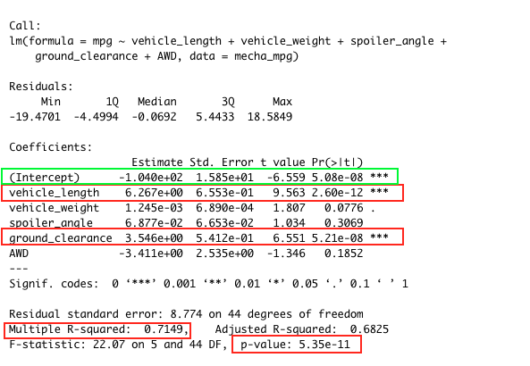

# MechaCar_Statistical_Analysis

## Overview
The following is an statisitical analysis using R programming language for AutosRUs on their automobile performance. Their new MechaCar is "suffering from production troubles". The company is hoping to shed some light on the follwing

1. Determine what variables predict the MPG for vehicle prototypes
2. Evulate if manufacturing lots are statistically different from the mean population
3. Create summary stats on the PSI of suspension coils
4. Prepare a study to compare the MechaCar performance against vehicles from other manufacturers

The complete notebook analysis can be viewed here: [https://jjcode-databootcamp.github.io/MechaCar_Statistical_Analysis]

## Linear Regression to Predict MPG

1. Which variables/coefficients provided a non-random amount of variance to the mpg values in the dataset?
- ground_clearance with p-value=5.21e-08 which is << 0.05
- vehicle_length with p-value=2.60e-12 which is << 0.05

2. Is the slope of the linear model considered to be zero? Why or why not?

- Multiple R-squared = 0.7149 therefore there is a strong correlation between mpg and the independent variable. Hence why the slope is not considered to be zero. 

3. Does this linear model predict mpg of MechaCar prototypes effectively? Why or why not?

- This model does predict the mpg of the MechaCar prototype with some relative effectiveness. The r-squared value of 0.7149, highlighted indicates that the model is 71% accurate. However, it could probably do better.
## Summary Statistics on Suspension Coils

The design specifications for the MechaCar suspension coils dictate that the variance of the suspension coils must not exceed 100 pounds per square inch. 

Does the current manufacturing data meet this design specification for all manufacturing lots in total and each lot individually? Why or why not?

- The overall variance as shown in the "Total Summary" stats it is under 100 PSI. It meets specifications, there is a problem with one of the individual lots. As shown in the "Lot Summary" stats, the variance for Lot 3 is well over the acceptable threshold, at 170.28.

## T-Tests on Suspension Coils, 

- Suspension Coils Cumulative T-test

T-test for the suspension coils results shows the following 
- Across all manufacturing lots it shows that it is  not statistically different from the population mean. The p-value is not low enough (0.0603) for us to reject the null hypothesis.
- Lot 1 shows that they are not statistically different from the population mean, and the p-value is not low enough (1) for us to reject the null hypothesis.
- Lot 2 shows that they are not statistically different from the population mean, and the p-value is not low enough (0.6072) for us to reject the null hypothesis.
- Lot 3 shows that they are slightly statistically different from the population mean, and the p-value is just low enough (0.0417) for us to reject the null hypothesis. This lot may be need to be discarded, or at least more closely evaluated.

## Study Design: MechaCar vs Competition
Using knowledge of R, a statistical study to compare performance of the MechaCar vehicles against performance of vehicles from other manufacturers was designed.

### Overview 
There are many different inputs that consumers have to consider when they buy a car such as cost, affordability, alternative transportation, convenience, reliability, maintenance, resell value, safety, competitior models, environmentally friendly, gasoline efficiency, used vs new, features/add-ons, insurance  and etc...

#### Metric
- MPG (Gasoline Efficiency): Independent Variable
- Engine (Electric, Hybrid, Gasoline / Conventional): Independent Variable
- Resale Value: Independent Variable
- Average Annual Cost of ownership (Maintenance): Independent Variable
- Safety Feature Rating: Independent Variable
- Current Price (Selling): Dependent Variable
- Drive Package : Independent Variable

#### The null hypothesis or alternative hypothesis?
- Null Hypothesis: MechaCar is priced correctly based on the above variables compared to it's competitors
- Alternative Hypothesis: MechaCar is incorrectly priced based on the above variables compared to it's competitors
  

#### Statistical Tests
A multiple linear regression would be run in order to determine the which combination of the variable metrics have the highest correlation/predictability with the list selling price of the cars.